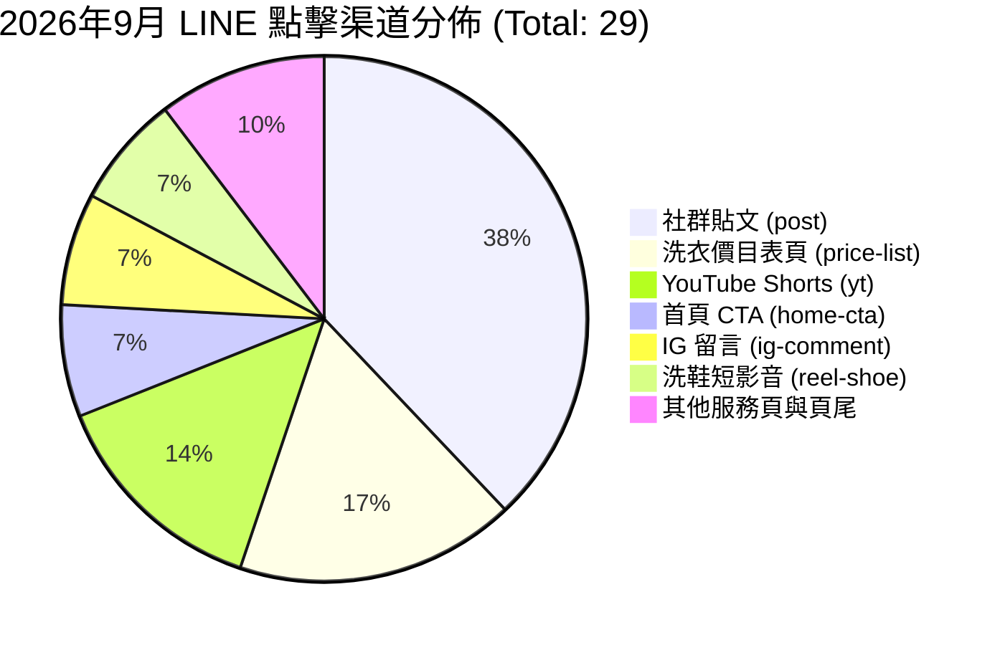

# 私享家洗衣店：真實營運與 GSC 索引全期復盤報告 (2026-08-21 ~ 2026-09-20)

> **報告定位**：本報告依據網站實際部署、Google Search Console (GSC) 逐日 URL Inspection 快照、GA4 流量紀錄與 LINE 點擊日誌，進行 100% 誠實的真實營運與搜尋引擎收錄復盤。不做任何虛假預測，只看第一手數據證據。

---

## 一、GSC 索引全期時序追蹤與收錄曲線

從 2026 年 8 月 21 日系統建立監控鏈路至 2026 年 9 月 20 日，全站收錄走勢如下：

| 日期區間 | Sitemap URL 總數 | 已建立索引 (Indexed) | 收錄率 | 主要狀態變化與關鍵事件 |
| :--- | :---: | :---: | :---: | :--- |
| **08/21 - 08/26** | 24 ~ 26 | 10 → 20 | 76.9% | 初期基礎頁面收錄，首頁、逢甲洗鞋、早期待客指南快速被 Google 接受。 |
| **08/30 - 09/03** | 32 ~ 33 | 25 ~ 26 | 78.8% | 穩定收錄期；此時核心成交頁（價目表、全市收送、西屯門市、大宗洗衣）初次上線但處於 Discovered 佇列。 |
| **09/04 - 09/06** | 89 | 26 → 35 | 39.3% | **大幅擴增期**：Sitemap 一口氣納入 40+ 篇精細材質洗護指南（羽絨、羊毛、皮衣、麂皮等），未收錄數（Discovered）激增至 52 頁。 |
| **09/11 - 09/16** | 89 | 53 → 66 | **74.2%** | **收錄爆發期**：Googlebot 陸續消化洗護指南，已收錄數衝上歷史高點 66 頁！證明 Google 判定本站專業內容具備實質價值。 |
| **09/17** | 89 | 55 (15 逾時) | 61.8% | GSC OAuth Token 屆滿 7 天過期，夜間檢驗斷訊，15 筆回報逾時。 |
| **09/20 (今日實測)** | 89 | **64** | **71.9%** | **Token 復原與權重重構**：64 頁確認 Submitted and indexed；4 大核心成交頁全數在 Discovered 佇列待抓取；0 檢驗失敗。 |

### 關鍵收錄診斷：4 大核心成交頁的「卡點」與「解方」
1. **卡點（Bottleneck）**：
   * 在 9/19 之前，全站 49 篇指南與在地頁面**只有單純指向首頁或無內部導流**，原本的 `#index-gap-rail` 僅安裝在 4 個舊頁面。
   * Googlebot 雖然收錄了 60 多篇洗護指南，但沒有內部連結權重（PageRank）流向「價目表」與「全市收送」。在 Google 眼中，這些成交頁成了邊陲孤島。
2. **解方（Phase 1 成果）**：
   * 9/19 已完成全站 49 篇指南內部鐵軌全面掛載，權重導流直接灌注 4 大成交頁。
   * 9/20 老闆已於 GSC Web 端手動提交「要求建立索引」，預計未來 24~48 小時內排程重爬。

---

## 二、真實流量與訪客行為數據復盤 (GA4 & Search Analytics)

### 1. GA4 全站流量表現 (8/26 ~ 9/19)
* **總造訪工作階段 (Sessions)**：219 次
* **Google 自然搜尋 (Organic Sessions)**：25 次
* **真實著陸頁 (Landing Pages) 排名**：
  1. 首頁 `/`：56 次
  2. **台中洗衣價目表 `/services/taichung-laundry-price-list.html`**：6 次（成交頁第一名！）
  3. 精品乾洗指南 `/guides/luxury-dry-cleaning.html`：3 次
  4. 窗簾清洗指南 `/guides/curtain-cleaning.html`：3 次
  5. 勃肯鞋保養指南 `/guides/birkenstock-care.html`：2 次
  6. 襯衫西裝乾洗 `/guides/shirt-suit-dry-cleaning.html`：2 次
  7. **東海洗衣收送 `/local/donghai-laundry-pickup.html`**：穩定貢獻 Google 自然搜尋訪客！

### 2. GSC 真實搜尋查詢意圖（潛在商機庫）

分析 Search Console 實測曝光與點擊關鍵字，發現台中消費者有極其具體的高價值特殊洗護需求：

| 搜尋關鍵字 | 平均排名 | 曝光數 | 點擊率 | 意圖分析與商機洞察 |
| :--- | :---: | :---: | :---: | :--- |
| **私享家 / 私享** | 3.1 ~ 4.9 | 53 | 7.9% | **品牌詞**：已有忠實回訪客或社群看過後指名搜尋。 |
| **逢甲洗衣店** | **9.0** | 5 | **20.0%** | **極高點閱率**：前十名內點閱率高達 20%，在地生活圈精準剛需。 |
| **東海洗衣店** | **4.4** | 5 | 0% | 排名第 4，但先前標題缺少「門市在西屯+全市免費收送」說明，改版後已開始累積自然流量。 |
| **台中洗地毯** | 12.1 | 14 | 0% | 高客單潛力詞！排名第 12，急需進前十。 |
| **台中窗簾清洗** | 31.8 | 12 | 0% | 高客單家庭件，換季大需求。 |
| **精品衣服送洗台中** | **6.0** | 8 | 0% | **排名第 6！** 高客單精品乾洗需求，SERP 點閱即成交。 |
| **絨毛娃娃清洗店 / 洗娃娃** | **8.0 ~ 11.0** | 11 | 0% | 藍海小眾需求！許多傳統店不收，私享家有極大優勢。 |
| **皮衣發霉洗衣店** | **3.8** | 6 | 0% | **排名第 3.8！** 台中潮濕換季急迫需求。 |
| **行李箱清洗服務台中** | **9.0 ~ 10.0** | 7 | 0% | **排名前十**，出國旺季剛需。 |
| **勃肯鞋臭 / 勃肯拖鞋清洗** | **1.0 ~ 13.0** | 14 | 0% | **排名第 1**，特定鞋款痛點極高。 |

---

## 三、真實顧客轉換與 LINE 點擊復盤 (Leads Attribution)

### 1. LINE 點擊時序月度對比
* **2026 年 8 月**：總計 **17 次** LINE 點擊。
* **2026 年 9 月 (截至 9/19)**：總計 **29 次** LINE 點擊（**成長率 +70.6%！**）。

### 2. 9 月 LINE 點擊來源管道深度剖析

1. **社群貼文文案 (`source=post`)**：貢獻 11 次點擊（佔比 37.9%），證實社群文案直接附帶清晰連結是最穩定的社群引流管道。
2. **全站最強網站轉換頁——洗衣價目表 (`taichung-laundry-price-list`)**：
   * 貢獻 **5 次直接點擊**（頁尾 4 次 + 頂部 CTA 1 次）。
   * **結論**：進入網站的使用者，最在意的就是「透明價格」；看完價格後最自然的下一步就是點擊 LINE 詢價！
3. **影音獲客 (`yt` + `reel`)**：貢獻 6 次點擊，短影音真實洗護展示具備強大引流潛力。

---

## 四、營運深層痛點與斷層（極度誠實的覆盤）

1. **斷層一：線上點擊到實體成單的「帳本空白」（Store Backfill Missing）**：
   * 系統已能精準記錄到「使用者看過哪一頁、在哪裡點擊了 LINE」。
   * 但客人進入 LINE 之後，「問了什麼物件、師傅報價多少、最後是否到店或收件、實付多少金額」，在資料庫中目前多數為 `null`。
   * **後果**：無法計算精準的每客獲客成本 (CAC) 與淨毛利，也缺乏第一手的真實案例金額對外展示給同業看。
2. **斷層二：高排名痛點詞的「CTR 浪費」**：
   * 如 `皮衣發霉` (排 3.8)、`精品衣服送洗` (排 6)、`台中洗地毯` (排 12)、`行李箱送洗` (排 9-10)。
   * 排名已經站在 Google 首頁或第二頁頂部，但因 SERP 標題與摘要不夠直接吸引人（例如沒直接標示「可到府收送、傳照片先估價」），造成有曝光卻沒點擊。
3. **斷層三：在地生活圈頁面覆蓋不足**：
   * 東海頁面已證明在地搜尋有效，但台中核心高消費族群集中的「南屯區（八期、文心森林公園）」與「北區（中國醫大、科博館）」尚無專屬著陸頁。

---

## 五、下一步全面優化作戰計畫 (Optimized Action Plan)

基於上述數據事實與 ChatGPT 示範店雙軌策略，計畫優化為三層落地戰略：

### 第一層：短期速效戰（1 ~ 3 天）
1. **LINE OA 雙軌接待自動化部署**：
   * 歡迎詞加入「同業夥伴輸入『同行』由老闆親自說明」提示。
   * 設定關鍵字「同行」自動回應模板（真實店長角色，說明系統、成本與合作）。
   * 建立輕量化「LINE 詢價週回填紀錄」，補足線下成交金額。
2. **複製東海經驗，拓展兩大高意圖在地著陸頁**：
   * `local/nantun-laundry-pickup.html`（南屯區：鎖定八期、七期南、文心森林公園大樓代收送）。
   * `local/north-district-laundry-pickup.html`（北區：鎖定中國醫大醫護工作服、一中商圈、科博館）。
3. **建立 B2B 同行展示指南頁**：
   * `guides/laundry-partner-showcase.html`（主標題：「我自己就是洗衣店老闆，我先把自己的店做給你看」；公開搜尋引流、透明價目表與接待數據）。

### 第二層：點擊率激增戰（4 ~ 14 天）
4. **高排名長尾詞（地毯、窗簾、皮衣、精品、行李箱）Title & Snippet 精準打擊**：
   * 針對 GSC 已排名進前十的頁面，優化 SERP 顯示文案，加入「一件也收、台中免費到府收送、傳照片先報價」，將大量現有曝光轉化為點擊！
5. **啟動低成本線下引流小試驗（E01 LINE Pay 地圖 + E07 包裹卡）**：
   * 印製 150 張實體服務卡放入 2 間周邊合作店家包裹，帶專屬 QR Code / 追蹤碼（如 `?source=parcel-partner`）。

### 第三層：28 天閉環與同業合作試行（15 ~ 28 天）
6. **28 天全數據閉環復盤**：
   * 追蹤 4 大成交頁由 Discovered 轉為 Indexed 之正式成效。
   * 統計實付行銷費用（實質趨近 0 元自然流量）vs 實際營收。
   * 形成私享家「引流示範店」完整實證白皮書，作為台中及跨縣市洗衣同業加盟合作與軟體系統推廣的堅實後盾。
